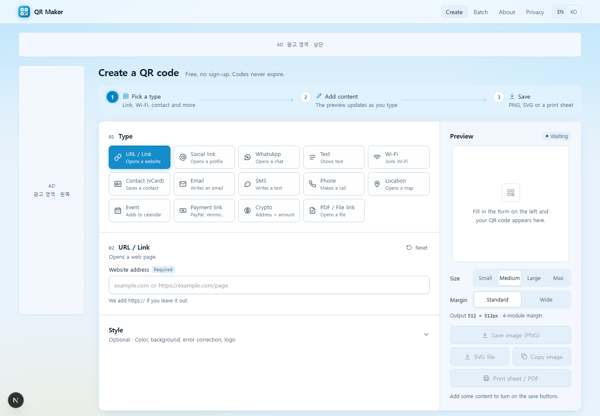
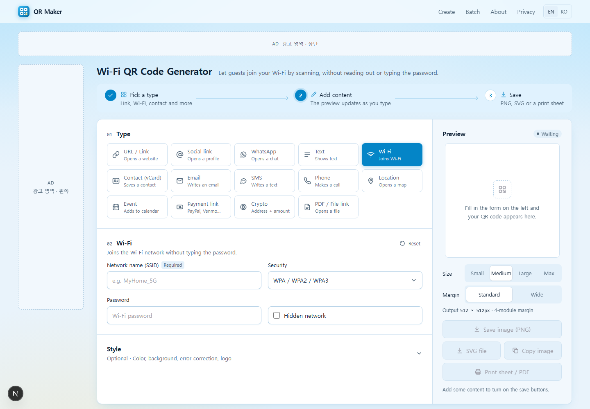
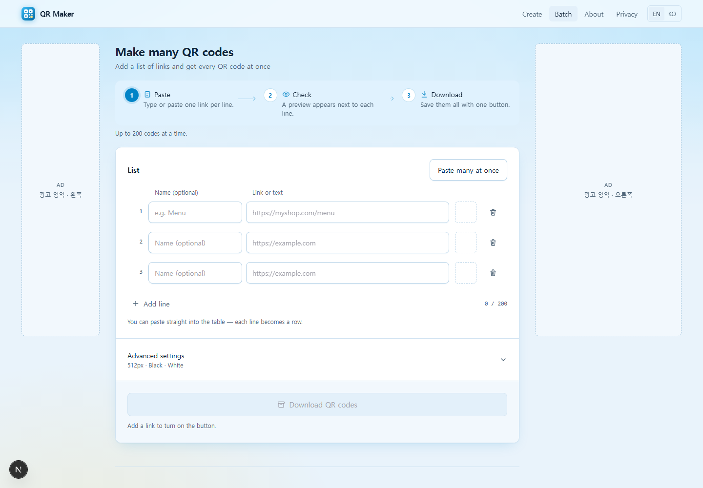
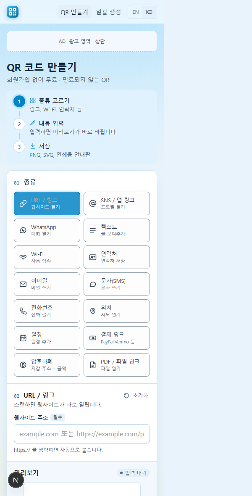

# QR Maker — 무엇이든 QR 코드로 바꾸는 무료 생성기


URL·SNS·WhatsApp·Wi-Fi·연락처·결제 링크 등 **14종 정보를 QR 코드로** 만드는 공개 웹서비스입니다.
QR은 브라우저에서 생성되는 **정적 코드**라 만료되지 않고 서버에 종속되지 않습니다(경쟁 서비스의 "동적 QR + 구독" 모델을 의도적으로 배제).
해외 사용자가 주 타깃이라 **영어가 기본**(`/`), 한국어는 `/ko`. 수익은 AdSense 광고 5슬롯, 유입은 타입별 SEO 랜딩 페이지 28개. 방문자가 저장한 QR 내용은 운영자 전용 관리자에서 확인합니다.

## 스크린샷

> 광고 자리는 개발 모드의 점선 placeholder입니다.

| | |
|---|---|
| **메인** — 14종 타입, 실시간 미리보기, 크기·여백·꾸미기  | **타입별 랜딩** — 검색어에 맞춘 제목 + 타입 선택된 생성기 + 고유 콘텐츠·FAQ  |
| **일괄 생성** — 엑셀 붙여 넣기 → PNG ZIP, 외부 라이브러리 없는 ZIP 작성기  | **모바일(한국어)** — 390px, 광고 3슬롯  |

## 주요 기능

- **QR 14종**: URL · SNS/앱 링크(28개 플랫폼 프리셋, 링크 붙여 넣기 자동 인식) · WhatsApp · 텍스트 · Wi-Fi · 연락처(vCard 3.0) · 이메일 · SMS · 전화 · 위치 · 일정(iCalendar) · 결제 링크(PayPal/Venmo/Cash App… 금액 사전 입력) · 암호화폐(BIP-21/EIP-681) · PDF/파일 링크
- **출력**: PNG(256~2048px, 모듈 단위 정수 스케일 보정으로 픽셀 정확) · SVG · 클립보드 복사 · **인쇄용 A4 안내판**(제목/부제 편집 → 브라우저 인쇄/PDF)
- **꾸미기**: 색 프리셋 8종 + 직접 선택, 배경(흰색/연회색/아이보리/투명), 복원력, 중앙 로고(자동 ECC H), 대비 경고
- **일괄 생성**: 표 편집기 + 엑셀 2열 붙여 넣기, 줄별 링크/텍스트 자동 판별, 최대 200개 → `001-이름.png` ZIP + `index.csv`
- **i18n/SEO**: 경로 기반 EN/KO(hreflang, sitemap 36 URL), 타입별 랜딩 14×2(고유 본문 400~600단어, `FAQPage`·`SoftwareApplication` JSON-LD)
- **광고**: AdSense 슬롯 5곳(상단·좌·우·하단·본문 중간), 팝업/오버레이 없음, 다운로드 버튼과 거리 확보, `/ads.txt` 자동
- **방문자 기록**: PNG/SVG/복사/인쇄/일괄 저장 시에만 종류·내용·IP·브라우저 기록(입력 중 전송 없음). Wi-Fi 비밀번호는 저장 전 항상 `****`. IP당 분당 30회 제한, 보관 90일 자동 정리
- **관리자**: 대시보드(KST 집계), 기록 검색·삭제·CSV(BOM, 수식 주입 차단), 설정(사이트 URL·AdSense ID·슬롯 ID — 재배포 없이 변경), 감사 로그(변경 전/후 값)

## 관리자 3중 잠금

| 계층 | 동작 | 설정 |
|---|---|---|
| 비밀 입구 URL | `/admin`은 누구에게나 **일반 404와 동일한 응답**. `https://<도메인>/<ADMIN_PATH>`를 먼저 열면 30일 게이트 쿠키가 생기고 그 브라우저에서만 `/admin`이 열림 | `ADMIN_PATH` |
| 비밀번호 + OTP | 인증 앱(Google Authenticator 등) 6자리 코드, RFC 6238 직접 구현(재사용 차단). 5회 실패 시 10분 잠금, 실패마다 지연 | `ADMIN_PASSWORD`, `ADMIN_TOTP_SECRET` (`npm run totp-setup`) |
| IP 허용 목록(선택) | 지정 IP/CIDR 외에는 입구 URL조차 404 | `ADMIN_ALLOWED_IPS` |

세션 쿠키는 HTTPS에서 `__Host-` 접두 + `SameSite=Strict` + 브라우저 지문 바인딩, 24시간 만료. 관리자 응답 `noindex`/`no-store`, robots.txt에 관리자 경로 미노출. `X-Real-IP`는 Caddy가 덮어쓰며 앱 포트는 외부에 publish하지 않습니다.

## 아키텍처 (오라클 클라우드 배포 구성)

```
방문자 ──HTTPS──▶ Caddy (자동 TLS, 보안 헤더, 64KB 본문 캡) ──▶ Next.js 16 standalone (Node, non-root)
                       │                                            │ better-sqlite3 (WAL)
                  OCI A1 (Docker Compose) ───────────────────────▶ ./data/qr.db (볼륨)
                       │
                  배포: git pull && docker compose up -d --build  (deploy.sh)
```

- **단일 서버·단일 파일 DB**: 운영 비용 0원(무료 티어). 백업은 `qr.db` 파일 하나
- **설정은 DB, 비밀은 .env**: 사이트명·URL·광고 ID는 관리자 화면, 비밀번호·키·입구 경로는 환경변수
- **QR 인코더는 순수 함수**: `src/lib/qr/encoders.ts` — Wi-Fi 이스케이프, vCard, VEVENT(UTC/종일 DTEND 미포함), wa.me, BIP-21 등 `node:test` 30건으로 고정

## 구조

```
src/app/                 라우트: / /ko /batch /[slug] /ko/[slug] /admin/* /api/*
src/components/qr/       생성기 UI(타입 타일·폼·미리보기·꾸미기·플랫폼 피커·인쇄 안내판·렌더 헬퍼)
src/components/batch/    일괄 생성(표 편집기, 붙여 넣기 파서, STORE ZIP 작성기)
src/components/pages/    Home/Landing/Batch/About/Privacy 본문(언어 공유)
src/lib/qr/              타입·인코더·저장용 마스킹 (+ 테스트)
src/lib/i18n/            ko/en 사전, 랜딩 콘텐츠, slug 매핑
src/lib/{auth,adminAccess,totp}.ts   세션·게이트·IP 허용목록·TOTP
src/proxy.ts             locale 헤더, 관리자 게이트/404, /en→/ 301
```

## 로컬 실행

```bash
cp .env.example .env     # ADMIN_PASSWORD, SESSION_SECRET(openssl rand -hex 32), ADMIN_PATH
npm ci
npm run dev              # http://localhost:3000  (관리자: http://localhost:3000/<ADMIN_PATH>)
npm test                 # 인코더·TOTP 단위 테스트
npm run build
```

개발 모드에서는 광고 자리가 점선으로 표시됩니다. DB는 `./data/qr.db`에 자동 생성됩니다.

## 서버 배포 (오라클 클라우드 Ubuntu)

1. OCI 콘솔 → VCN 보안 목록 → Ingress **80, 443** 추가
2. 서버에서 (private 저장소는 GitHub 토큰을 비밀번호로):
   ```bash
   git clone https://github.com/vittroi384/qr-web.git ~/qr-web
   bash ~/qr-web/scripts/server-setup.sh   # iptables 개방, Docker 설치, .env 생성(SESSION_SECRET·ADMIN_PATH 자동)
   cd ~/qr-web && nano .env                 # ADMIN_PASSWORD 입력, DOMAIN은 DNS 연결 후
   newgrp docker && ./deploy.sh
   ```
3. OTP 등록: `docker compose exec app node scripts/totp-setup.mjs` → QR을 인증 앱으로 스캔 → `.env`에 `ADMIN_TOTP_SECRET` 추가 → `docker compose up -d`
4. 도메인 연결 시 `.env`의 `DOMAIN=`만 채우면 Caddy가 HTTPS를 자동 발급. 관리자 설정의 **사이트 URL**도 실제 도메인으로 변경
5. 업데이트: `./deploy.sh` (git pull + 재빌드). 백업: `docker compose exec -T app node -e "require('better-sqlite3')('/app/data/qr.db').backup('/app/data/backup.db')"`

> `DOMAIN`을 비우면 평문 HTTP로 동작하며 세션 쿠키에 `Secure`가 붙지 않습니다(테스트 용도). HSTS에 `includeSubDomains`가 포함되어 있으니 HTTP 전용 서브도메인이 있으면 Caddyfile에서 빼세요.

## AdSense 연결

1. 실제 도메인으로 배포 후 AdSense에 사이트 추가 → 게시자 ID(`ca-pub-…`) 발급
2. 관리자 → 설정 → 게시자 ID 입력 + **광고 표시** 체크 → `/ads.txt`와 스크립트가 자동 활성화 → 사이트 확인·심사
3. 승인 후 디스플레이 광고 단위 5개 생성 → 각 `data-ad-slot`을 설정의 슬롯 ID 칸에 입력. 비어 있는 자리는 렌더되지 않음. 자동 광고는 끄기(배치 규칙이 깨짐)

## 환경변수

| 이름 | 설명 |
|---|---|
| `DOMAIN` | Caddy용 도메인. 비우면 `:80` 평문 HTTP |
| `ADMIN_PATH` | 관리자 비밀 입구 경로 (`/gate-…`, 영숫자 8~64자). 없으면 게이트 비활성(개발용) |
| `ADMIN_PASSWORD` | 관리자 비밀번호 |
| `ADMIN_TOTP_SECRET` | OTP 비밀키 (없으면 OTP 생략 — 운영에서는 설정 권장) |
| `ADMIN_ALLOWED_IPS` | 관리자 접근 허용 IP/CIDR 목록 (선택) |
| `SESSION_SECRET` | 세션·게이트 쿠키 서명 키 (`openssl rand -hex 32`) |
| `DATABASE_PATH` | SQLite 경로. Docker에서는 `/app/data/qr.db` 고정 |

## 설계 결정

- **정적 QR만**: 사용자가 인쇄한 QR이 이 서버의 가동 여부에 종속되지 않게. 리다이렉트·통계·수정 기능(동적 QR)은 피싱 중계·운영 책임을 동반하므로 배제
- **기록은 저장 시점에만**: 입력 중 디바운스 전송을 없애 "타이핑마다 저장되는" 느낌을 제거. PNG/SVG/복사/인쇄/ZIP 클릭이 곧 "만든 것"
- **민감값은 서버에 도달하기 전·후 모두 마스킹**: 클라이언트가 `****`로 보내고 서버가 다시 고정 마스킹. 설정으로 끌 수 없음
- **관리자는 존재 자체를 숨김**: 로그인 폼을 노출하는 대신 404로 응답해 무차별 대입의 표면을 없앰
- 전체 계획과 검증 기록은 [`docs/PLAN.md`](docs/PLAN.md)

## 라이선스

MIT
