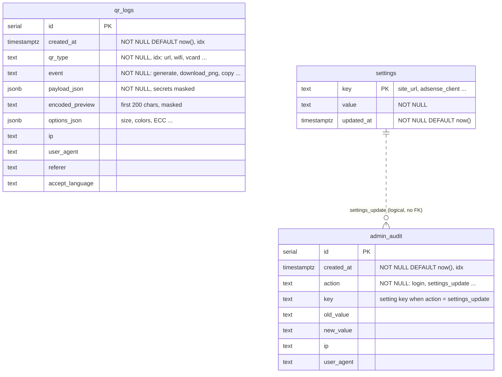

# ERD

PostgreSQL 16 스키마. 정의는 [`src/lib/db/schema.ts`](../src/lib/db/schema.ts)(Drizzle), 실제 DDL은 [`drizzle/`](../drizzle) 마이그레이션.

세 테이블은 서로 외래 키 없이 독립적입니다. 방문자 기록(`qr_logs`), 런타임 설정(`settings`), 관리자 활동(`admin_audit`)은 수명과 보관 정책이 달라서(기록 기본 90일, 감사 로그 365일, 설정은 영구) 일부러 연결하지 않았습니다. `admin_audit.key`는 `settings_update`일 때 `settings.key` 값을 담는 논리적 참조입니다.

## 인덱스

| 테이블 | 인덱스 | 용도 |
|---|---|---|
| `qr_logs` | `idx_qr_logs_created (created_at)` | 기간 필터, 대시보드 7/30일·14일 추이, 보관 기간 정리 |
| `qr_logs` | `idx_qr_logs_type (qr_type)` | 종류 필터, 종류별 집계 |
| `admin_audit` | `idx_admin_audit_created (created_at)` | 365일 보관 정리 |

목록·CSV는 `id DESC` 정렬(기본 키 인덱스)이며, CSV는 `id < 마지막 id` keyset 페이지로 1000행씩 읽습니다.
