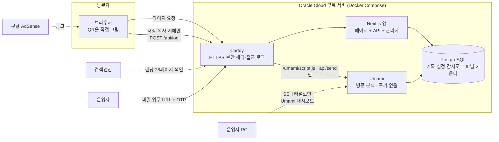
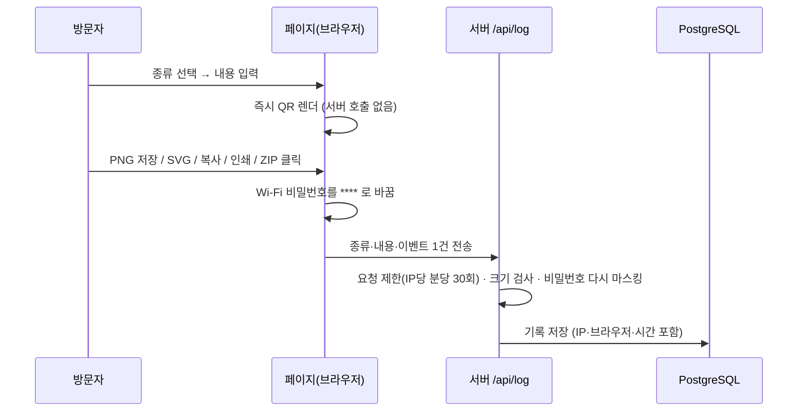
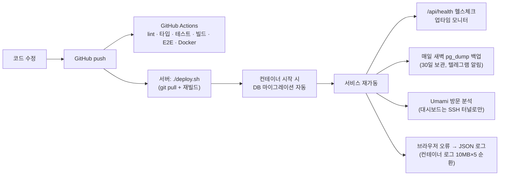

# QR Maker — 프로젝트 이야기 · 인수인계 · 면접 정리

> 이 문서는 **코드를 모르는 사람도 읽을 수 있게** 썼습니다. 기술 용어는 처음 나올 때 괄호로 풀어 쓰고, 그림은 모두 GitHub에서 바로 보이는 Mermaid 다이어그램입니다. 자세한 기술 사양은 [README](../README.md), 설계 결정의 근거는 [ADR](결정-기록/README.md), 작업·검증 이력은 [PLAN](계획.md)에 있습니다.

---

## 1. 이 서비스는 무엇인가

**"무엇이든 QR 코드로 바꿔 주는 무료 웹사이트"** 입니다. 카페 사장님이 Wi-Fi 비밀번호를, 식당이 메뉴판 링크를, 프리랜서가 명함 연락처를 QR로 만들어 인쇄해 붙이는 용도입니다.

- 주소를 치고 들어오면 바로 입력창이 보이고, 입력하는 즉시 QR이 그려집니다. 가입도 로그인도 없습니다.
- 만들 수 있는 것 14종: 링크, SNS 프로필(28개 플랫폼), WhatsApp 대화, 텍스트, Wi-Fi 접속, 연락처(명함), 이메일, 문자, 전화, 지도 위치, 캘린더 일정, 결제 링크(PayPal 등), 암호화폐 지갑, PDF/파일 링크.
- 결과물: PNG 이미지, SVG(인쇄용 벡터), 클립보드 복사, A4 인쇄 안내판, 여러 개를 한 번에 만드는 일괄 생성(ZIP).
- 영어가 기본(`/`)이고 한국어·스페인어·포르투갈어·독일어·프랑스어·일본어·힌디어·인도네시아어까지 9개 언어(`/ko` `/es` `/pt` `/de` `/fr` `/ja` `/hi` `/id`). 해외 사용자가 주 대상입니다.
- 수익은 구글 AdSense 광고(자리 6곳, 팝업 없음)와 인쇄 제휴 링크. 운영 비용은 **0원**(Oracle Cloud 무료 서버).
- 운영자 화면: 대시보드 · **통계**(언어별·페이지별·종류별 저장 수, 선택→미리보기→저장 퍼널) · 입력 기록(자동 분류·요약) · 설정 · 감사 로그. 방문 분석은 쿠키 없는 **Umami**를 같은 서버에서 자체 운영합니다.

### 한 줄로 말하는 차별점
> **"만든 QR은 절대 만료되지 않고, 이 사이트가 없어져도 계속 작동한다."**

시중 서비스 대부분은 QR 안에 *자기 서비스 주소*를 넣고 나중에 돈을 내지 않으면 QR을 끊어 버립니다("동적 QR"). 우리는 QR 안에 **사용자가 입력한 내용 자체**만 넣습니다("정적 QR"). 이 결정 하나가 제품·보안·수익 구조를 전부 정했습니다.

---

## 2. 용어 사전 (처음 보는 분을 위해)

| 용어 | 뜻 |
|---|---|
| 정적 QR / 동적 QR | 정적: QR 안에 내용이 직접 들어 있음. 동적: QR 안에는 서비스 주소만 있고 서버가 진짜 목적지로 보내 줌 |
| Next.js | 웹사이트를 만드는 도구(프레임워크). 화면과 서버 기능을 한 프로젝트에서 처리 |
| PostgreSQL | 데이터를 저장하는 데이터베이스(DB). 방문자 기록·설정·관리자 활동을 담음 |
| Drizzle ORM | 코드로 DB 테이블을 정의하고 질의하는 도구. "마이그레이션" = 테이블 구조 변경 이력 |
| Docker / Compose | 앱·DB·웹서버를 각각 "컨테이너"라는 상자에 담아 한 명령으로 띄우는 도구 |
| Caddy | 맨 앞에서 접속을 받는 웹서버. HTTPS 인증서를 자동 발급 |
| AdSense | 구글 광고. 페이지에 광고 자리를 두면 구글이 광고를 채우고 수익을 나눠 줌 |
| SEO / 랜딩 페이지 | 검색에 잘 걸리게 만드는 작업 / 특정 검색어("wifi qr code")를 노린 전용 페이지 |
| OTP (TOTP) | 인증 앱에서 30초마다 바뀌는 6자리 코드. 비밀번호 외 2차 잠금 |
| ADR | 설계 결정 기록(Architecture Decision Record). "왜 이렇게 했나"를 남긴 문서 |
| E2E 테스트 | 실제 브라우저를 자동으로 조작해 "입력 → 저장 → 기록" 전체 흐름을 검증하는 테스트 |
| Umami | 쿠키 없이 방문 수·국가·기기를 집계하는 오픈소스 분석 도구. 구글 애널리틱스 대신 우리 서버 안에서 돌림 → 동의 배너 불필요 |
| 퍼널 | "종류 선택 → 미리보기 → 저장"처럼 단계마다 몇 명이 남는지 보는 집계. 어디서 포기하는지 알 수 있음 |

---

## 3. 전체 구조 (한 장 그림)



핵심은 **QR 이미지는 서버가 만들지 않는다**는 점입니다. 브라우저가 그리기 때문에 서버 부하가 거의 없고, 서버가 멈춰도 이미 만든 QR은 멀쩡합니다.

---

## 4. 흐름도

### 4-1. 방문자가 QR을 만드는 흐름



**왜 "저장할 때만" 기록하나?** 처음엔 타이핑이 멈출 때마다 기록했는데, 직접 써 보니 "글자 칠 때마다 저장되는" 느낌이 불쾌했고 미완성 입력이 쌓였습니다. 그래서 *결과물을 가져가는 순간* = *QR 1개가 만들어진 순간*으로 정의했습니다. ([ADR-002](결정-기록/002-저장할-때만-기록.md))

### 4-2. 운영자가 관리자에 들어가는 흐름 (3중 잠금)

```mermaid
flowchart TD
  X["누군가 /admin 접속"] --> G{비밀 입구 URL을<br/>먼저 열었나?}
  G -- 아니오 --> N["404 — 존재하지 않는 페이지처럼 응답<br/>(일반 404와 크기까지 동일)"]
  G -- 예 --> I{허용된 IP?<br/>(설정했을 때만)}
  I -- 아니오 --> N
  I -- 예 --> L[로그인 화면]
  L --> PW{비밀번호 + 인증 앱 OTP}
  PW -- 5회 실패 --> LOCK[10분 잠금]
  PW -- 성공 --> SES["세션 쿠키 발급<br/>(브라우저 지문에 묶임, 24시간)"]
  SES --> ADM[대시보드 · 통계 · 기록 · 설정 · 감사 로그]
```

로그인 폼 자체를 숨기는 이유: 공개 사이트의 `/admin`은 자동 공격 봇의 1순위 표적이라, **문이 있다는 사실조차 안 보이게** 했습니다. ([ADR-003](결정-기록/003-관리자-입구-숨김.md))

### 4-3. 배포·운영 흐름



---

## 5. 개발 과정 (무엇을, 왜, 어떻게 바꿨나)

설계 → 구현 → 검증 → 재설계를 여러 번 반복했고, 구현과 별도로 코드 리뷰를 거쳐 고쳤습니다. 아래는 그 과정의 요약입니다.

### Phase 1 — 뼈대 (생성기 · 기록 · 관리자 · 배포 구성)
- 9종 QR 인코더(Wi-Fi 특수문자 이스케이프, vCard 3.0, 캘린더 VEVENT 등)와 단위 테스트, 브라우저 렌더, 기록 API, 관리자 4화면, Docker/Caddy.
- **1차 코드 리뷰: 차단.** CSV 내보내기의 수식 주입(엑셀이 `=cmd()`를 실행), 접속 IP 위조 가능, 요청 제한 응답 미비, 본문 크기 검사 순서, 시간대 불일치, 로그아웃 감사로그 오염 등 12건.
- 전부 수정 → 3차 리뷰 **통과**. 이 과정에서 "민감값은 저장 전에 양쪽에서 마스킹"이 원칙으로 굳어졌습니다. ([ADR-004](결정-기록/004-저장-전-마스킹.md))

### Phase 2 — 사용성 (비전공자가 설명 없이 쓰게)
- 밝은 라이트 테마로 전면 재설계, 한 화면에 "종류 → 입력 → 미리보기".
- 기록 방식을 두 번 바꿈: 자동 기록 → 생성 버튼 → **저장 시점에만**. 사용자 피드백으로 확정.
- 꾸미기 옵션을 슬라이더 나열에서 **프리셋**(색 8종·배경·복원력·로고)으로. 일괄 생성은 "라벨,내용" 문법을 없애고 **표 편집기 + 엑셀 붙여 넣기**로.
- 플랫폼 선택 드롭다운(25개)을 **아이콘 타일 + 링크 붙여 넣기 자동 인식**으로.

### Phase 3 — 성장 구조 (영어 우선 · 타입 확장 · SEO)
- 해외가 주 타깃이므로 `/`를 영어로 두고 나머지 8개 언어는 `/<언어코드>` 아래에 배치. 경로 기반이라 검색엔진이 언어별로 색인. ([ADR-005](결정-기록/005-경로-기반-다국어-영어-기본.md))
- WhatsApp·결제 링크·암호화폐·PDF 링크 추가(14종), SNS 프리셋 28개.
- **타입별 랜딩 페이지 28개**(14 × 2 언어): 검색어에 맞춘 제목 + 타입이 미리 선택된 생성기 + 각각 다른 본문·FAQ·구조화 데이터. "qr code generator"는 포화 시장이라 "whatsapp qr code"처럼 좁은 검색어를 페이지 단위로 공략.
- 사용 사례 랜딩(메뉴판·청첩장·명함·구글 리뷰·카페 Wi-Fi) 추가.

### Phase 4 — 보안 (운영자만 들어오게)
- 비밀 입구 URL + OTP(RFC 6238을 라이브러리 없이 구현, 코드 재사용 차단) + IP 허용목록.
- **5차 리뷰에서 경고 3건**: HTTPS에서 로그아웃 쿠키가 안 지워짐, 로그인 API가 게이트 서명을 검증하지 않음, CSV 내보내기에 IP 검사 누락 → 모두 수정, 관리자 404를 일반 404와 동일하게 만들어 존재 노출 제거.
- 운영 이미지로 실제 기동 검증(게이트 없이 404 → 입구 → OTP → 대시보드).

### Phase 5 — 데이터 계층 · 품질 (포트폴리오 관점)
- SQLite → **PostgreSQL + Drizzle** 전환. 빌드는 DB 없이 성공하도록, 마이그레이션은 컨테이너 시작 시 자동. ([ADR-006](결정-기록/006-PostgreSQL-전환.md))
- **6차 리뷰 통과**(SQL 인젝션·날짜 경계·마스킹 회귀·compose 설정 실측).
- Playwright E2E(생성→저장→기록 검증, ZIP 구조, 관리자 게이트, SEO, 모바일 넘침, 접근성 axe) + CI.
- 관측성: `/api/health`, 구조화 JSON 로그, Caddy 접근 로그 롤링, 백업 실패 알림.
- Lighthouse: 성능 97~100 · 접근성 100 · SEO 100 · 모범사례 100.

### Phase 6 — 다국어 9개 · 분석 · 관리자 UX
- 언어 7개 추가(스페인·포르투갈·독일·프랑스·일본·힌디·인도네시아). 단순 번역이 아니라 **언어별로 본문을 새로 써서** 현지 검색어·전화번호·통화·법규(브라질 Pix·인도 UPI·인도네시아 QRIS는 "아님"을 명시, 일본 QRコード 상표 고지)를 반영. 랜딩 171페이지, sitemap 207 URL.
- **분석**: 관리자 통계 탭(일별·언어별·페이지별·종류×저장 방식·시간대·퍼널), 퍼널은 IP·브라우저 없이 일·언어·종류·단계별 숫자만. 방문 분석은 **Umami 자체 호스팅**(쿠키 없음 → 동의 배너 없이 유럽 트래픽 가능), 브라우저 오류 수집 API, 컨테이너 로그 순환.
- **입력 기록 재설계**: 종류 팝오버 필터·기간 프리셋, 자동 분류(도메인·플랫폼·방문자 언어·저장 방식), 내용 요약(전화번호 `+82 ···5678` 마스킹), 무한 스크롤. 광고 자리 6곳, 모바일 종류 타일 6개만 노출.
- **7·8차 리뷰 → 수정 후 통과**: Umami 대시보드를 서브도메인으로 공개하면 기본 계정 상태에서 인증서 로그 스캐너가 먼저 찾아 탈취할 수 있음 → 대시보드는 서버 안(127.0.0.1)에만 열고 SSH 터널로 접근, 공개는 추적 스크립트 2개 경로만. 관리자 푸터 전환용 요청 헤더를 위조하면 404 페이지에서 관리자 존재가 드러남 → 비밀값 파생 마커로 교체. ([ADR-007](결정-기록/007-자체-호스팅-방문-분석.md))

### Phase 7 — 공개 운영 시작 · 사용자 피드백 반영 (2026-10-04 ~ 05)
- **도메인 getqrmaker.com 연결**: 서버의 80/443은 다른 프로젝트가 쓰고 있어서 Cloudflare 프록시(Flexible) + Origin Rule(대상 포트 8080)로 붙임. Caddy에 Cloudflare IP 대역을 신뢰 프록시로 등록해 **실제 방문자 IP**가 앱에 전달되게 함(아니면 속도 제한·로그인 잠금이 전 세계 방문자를 엣지 IP 하나로 취급). 우회 요청은 신뢰하지 않으므로 IP 위조 불가. ([배포-절차 2-C](배포-절차.md))
- **퍼널 집계 수정**: 홈에 접속만 해도 기본 종류(URL)가 "선택"으로 집계되던 문제 → 실제로 종류를 고른 때만 집계, 잘못 쌓인 데이터는 비움.
- **소유자 피드백 반영(UI 전면 3차)**: 단계 진행도 게이지(단계당 1/3), 종류 타일 8개 + 더보기·재클릭 해제, Pretendard 글꼴·굵기·버튼 확대, 4컬럼 푸터 + 언어 행 + 상표 고지, 광고 자리별 on/off(상단 기본 off), 미리보기를 별도 sticky 카드로, 꾸미기(프레임 모양 13종 아이콘 타일 → 문구 → 색 → 로고, 색·배경·복원력은 드롭다운 하나), 일괄 생성 카드 3분할.
- **첫 방문 언어 안내**: 루트(`/`)만 브라우저 언어(Accept-Language)에 맞는 판으로 302. 검색엔진 제외, 언어 메뉴로 고른 판은 쿠키(1년)로 기억, 깊은 링크는 손대지 않음(검색 결과는 hreflang으로 이미 언어가 맞음).
- 단위 156건 · E2E 34건. 폰 가로 넘침은 E2E가 잡아내 수정(한 줄 문구가 카드 열 너비를 밀던 것 → `grid-cols-[minmax(0,1fr)]`).

### 바꾼 것과 바꾸지 않은 것
| 바꿈 | 바꾸지 않음 (의도적) |
|---|---|
| 기록 방식 3번, DB 2번, 언어 기본값 1번, UI 전면 3번, 언어 2 → 9개 | 정적 QR 원칙 — 동적 QR·구독·QR 리더 기능은 끝까지 넣지 않음 |
| 보안 계층은 리뷰마다 한 겹씩 추가 | 서비스 브랜딩·워터마크를 QR에 넣지 않음 |

---

## 6. 코드 리뷰에서 배운 것 (면접에서 말할 거리)

1. **"설정으로 끌 수 있는 보안"은 보안이 아니다** — 초기엔 비밀번호 마스킹이 관리자 설정이었고 길이도 노출됐습니다. 리뷰 지적 후 "항상, 양쪽에서, 고정 길이"로 바꿨습니다.
2. **404로 숨기려면 끝까지 숨겨야 한다** — 처음엔 관리자 404의 본문이 비어 있어서 일반 404(27KB)와 구분됐습니다. 응답 크기만으로 경로 존재가 드러난 셈. 일반 404 페이지로 rewrite해 동일하게 맞췄습니다.
3. **쿠키 삭제는 생성과 같은 속성이어야 한다** — HTTPS 전용(`__Host-`) 쿠키는 `Secure` 없이 지우라는 명령을 브라우저가 무시합니다. 로컬(HTTP)에선 재현되지 않아 리뷰가 아니면 놓쳤을 문제.
4. **테스트 도구의 함정** — Git Bash가 `/gate-…` 인자를 Windows 경로로 바꿔 넣어 "운영 빌드에서 게이트가 안 된다"고 오판할 뻔했습니다. 코드가 아니라 측정 도구를 먼저 의심하는 습관.
5. **표준은 끝까지 읽기** — 캘린더 종일 일정의 종료일은 "포함하지 않는 날"(RFC 5545). 처음 구현은 하루 짧게 들어갔고, 기존 테스트가 그 동작을 고정하고 있어 테스트도 함께 고쳤습니다.
6. **QR 선명도는 정수 배율** — 512px 고정으로 그리면 칸마다 1px씩 폭이 달라집니다. 칸 수에 맞춰 "칸당 정수 픽셀"로 크기를 보정했습니다.
7. **기본 계정이 있는 서비스는 공개하는 순간 경쟁이 시작된다** — Umami는 admin/umami로 뜹니다. HTTPS 인증서가 발급되면 공개 로그(CT)에 올라가고, 스캐너가 몇 분 안에 찾아옵니다. "바로 비밀번호를 바꾸세요"라는 안내는 이 경쟁을 못 막습니다. 아예 외부에 열지 않고 SSH 터널로만 들어가게 했습니다.
8. **요청 헤더는 신뢰 경계 밖** — 관리자 푸터를 바꾸려고 프록시가 붙인 `x-admin: 1` 헤더를 클라이언트도 붙일 수 있었고, 프록시가 안 거치는 경로(404·정적 파일)에서 관리자 존재가 드러났습니다. 비밀값에서 파생한 값으로 바꾸고 404 응답에서는 헤더를 지웠습니다.
9. **테스트 서버 재사용의 함정** — E2E 13건이 갑자기 실패했는데 코드가 아니라 이전 세션의 옛 빌드 서버가 같은 포트를 잡고 있던 것. "재사용" 옵션은 편하지만 무엇을 테스트하는지 확인해야 합니다.

---

## 7. 면접 예상 질문과 답 포인트

- **왜 동적 QR을 안 했나?** → 사용자의 인쇄물이 내 서버 가동에 종속되는 걸 원치 않았다. 피싱 중계·Safe Browsing 차단·계정/결제 운영 부담도 피했다. 대신 통계·수정 기능은 포기했다.
- **방문자 입력을 저장하는 게 개인정보상 괜찮나?** → 저장 시점 한정, Wi-Fi 비밀번호는 양쪽 마스킹, 90일 자동 삭제, 개인정보처리방침 고지. 운영자도 비밀번호를 볼 수 없다.
- **왜 PostgreSQL로 바꿨나? SQLite로 충분하지 않았나?** → 트래픽상 충분했다. 바꾼 이유는 마이그레이션 이력·표준 백업·관리형 DB 이전 경로·다른 프로젝트와의 스택 일관성. 바꾸면서 "빌드는 DB 없이"를 조건으로 걸었다.
- **인메모리 rate limit은 서버가 늘어나면?** → 단일 인스턴스 전제이고 ADR에 적어 뒀다. 수평 확장 시 Redis로 옮기는 지점이 명확하다.
- **AI 도구를 어떻게 썼나?** → 구현 보조로 썼고, 결과는 별도 코드 리뷰와 테스트로 검증했다. 설계 결정과 리뷰 지적을 받아들일지는 직접 판단했다.
- **수익은?** → 솔직히 월 수십 달러 규모가 현실적. 목적은 "실트래픽이 있는 서비스를 설계·배포·운영한 경험"이고, 비용이 0이라 손실이 없다.
- **왜 구글 애널리틱스 대신 Umami를 직접 돌리나?** → 쿠키가 없어 유럽(GDPR) 트래픽에도 동의 배너 없이 쓸 수 있고(독·프·스페인어 랜딩이 있음), 데이터가 내 DB에 남으며, 운영 경험 자체가 포트폴리오. 단, 대시보드는 외부에 안 열고 SSH 터널로만.
- **퍼널 데이터로 무엇을 할 건가?** → "선택은 많은데 미리보기가 적다"면 입력 폼 문제, "미리보기는 많은데 저장이 적다"면 결과물·버튼 문제. 언어별로 보면 번역 품질 문제인지도 구분된다. 숫자만 세고 개인 식별은 하지 않는다.
- **광고를 더 넣으면 수익이 늘지 않나?** → 자리 6곳 중 처음엔 4곳만 켠다. 도구형 사이트는 광고가 늘수록 체류·재방문이 줄어 총수익이 오히려 줄기 쉽고, 다운로드 버튼 근처 광고는 "실수 클릭 유도"로 계정 정지 사유. 자동 광고도 같은 이유로 끈다.

---

## 8. 인수인계 체크리스트 (운영자용)

**매일 자동**: DB 백업(새벽 4:30, 30일 보관), 헬스체크, 기록 90일 정리.
**주 1회 (1분)**: 업타임 모니터 메일 확인, 관리자 대시보드·통계 한 번 열기(어느 언어·페이지가 잘 되는지).
**분기 1회 (5분)**: `./deploy.sh`로 업데이트, 백업 파일 하나 복원 테스트.

| 상황 | 할 일 |
|---|---|
| 사이트가 안 열림 | 서버 SSH → `docker compose ps` → `docker compose logs app --tail 100` → `docker compose restart`. Cloudflare 대시보드의 SSL 모드(Flexible)·Origin Rule(8080)도 확인 |
| 관리자 들어가기 | `https://getqrmaker.com/<ADMIN_PATH>` → 비밀번호 + OTP (터널 불필요) |
| 관리자 입구 URL을 잊음 | 서버 `.env`의 `ADMIN_PATH` 확인 |
| 코드 업데이트 | 서버 `~/qr-web`에서 `./deploy.sh` |
| OTP 기기 분실 | `.env`의 `ADMIN_TOTP_SECRET` 지우고 `docker compose up -d` → 비밀번호만으로 로그인 → `docker compose exec app node scripts/totp-setup.mjs`로 재발급 |
| 도메인 변경 | `.env`의 `DOMAIN` + 관리자 설정의 사이트 URL 두 곳 |
| 광고 교체·자리 끄기 | 관리자 → 설정 → 슬롯 ID, "자리 켜기" 체크박스 (재배포 불필요. 상단 가로는 기본 꺼짐) |
| 방문 통계 보기 | 내 PC에서 `ssh -L 3001:127.0.0.1:3001 ubuntu@서버IP` → 브라우저에서 `http://localhost:3001` (Umami. 외부에서는 열리지 않음) |
| 방문 분석 켜기/끄기 | 관리자 → 설정 → 방문 분석의 스크립트 URL·웹사이트 ID (둘 다 비우면 꺼짐) |
| 어떤 QR·언어가 인기인지 | 관리자 → 통계 (저장 수·퍼널), 입력 기록의 자동 분류(도메인·플랫폼) |
| 데이터 복원 | `gunzip -c backups/qr-날짜.sql.gz \| docker compose exec -T db psql -U qr -d qr` |
| 서버 이전 | 새 서버에서 `scripts/server-setup.sh` → `.env` 복사 → 백업 복원 → DNS A 레코드 교체 |

비밀값(`.env`)은 저장소에 없습니다. 서버에만 있으니 **별도로 안전하게 보관**하세요.

---

## 9. 파일 지도 (어디에 무엇이 있나)

```
src/app/            페이지와 API. [slug]는 랜딩 페이지, admin/*은 관리자, api/*는 서버 기능
src/components/qr/  생성기 화면(타입 타일·입력 폼·미리보기·꾸미기·인쇄 안내판)
src/components/batch/ 일괄 생성(표 편집기·붙여 넣기 파서·ZIP 작성기)
src/components/pages/ 페이지 본문(언어 공통). app/ko/*는 이걸 한국어로 호출
src/lib/qr/         "입력 → QR 문자열" 인코더와 테스트. 제품의 핵심 로직
src/lib/i18n/       9개 언어 문구(`<코드>.ts`), 랜딩 콘텐츠(`landing.<코드>.ts`), 주소(slug) 매핑
src/lib/db/         PostgreSQL 스키마 · drizzle/ 는 마이그레이션 SQL
src/lib/{auth,adminAccess,totp}.ts  로그인·게이트·OTP
src/lib/{stats,analytics}.ts  통계 집계(KST)·퍼널 요청 검증·referer → 언어/페이지
src/lib/qr/summarize.ts  기록 1건을 사람이 읽는 한 줄로(도메인·플랫폼·마스킹) + 자동 분류
src/components/admin/  관리자 전용 UI(종류 필터·기간 프리셋·무한 스크롤·한 줄 푸터)
src/components/analytics/ Umami 추적 스크립트 삽입(관리자 페이지 제외)
src/proxy.ts        모든 요청의 첫 관문: 언어 판별, 관리자 404 처리
e2e/                브라우저 자동 테스트
scripts/            서버 초기 설정, 배포(Umami DB 자동 생성), 백업(qr + umami), OTP 발급, 마이그레이션, db-init/
docs/               이 문서, ADR(설계 결정), ERD(테이블 그림), PLAN(작업·검증 이력)
```

---

*마지막 갱신: 2026-10-02. 코드가 바뀌면 이 문서의 §5·§9부터 손보세요.*
